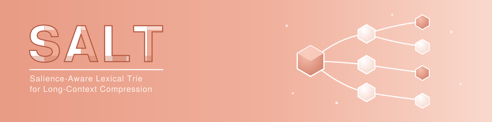

# SALT

  

## Salience-Aware Lexical Trie for Long-Context Compression

SALT shrinks a long document down to a fixed size before it is sent to a language
model, keeping the sentences that carry the most information. It works with any
model, produces a shorter plain-text prompt, and cuts the compute, memory, and
wait time that long inputs cost.

**The problem.** When a prompt is too long, existing compressors give each
sentence a single relevance score and keep the top-scoring ones until the budget
runs out. Under a tight budget this lets the document's main topic swallow the
whole budget, so smaller but still important points get dropped - a failure called
*theme collapse* (in multi-hop questions, for example, it can keep
passages about the main entity yet lose the one sentence that links it to a
second).

**The solution.** SALT first maps the document's recurring themes by organizing
each sentence's keywords into a trie, a small keyword tree ordered by how often
those keywords recur, then spreads the budget across those theme branches
before choosing sentences, so minor themes keep their share instead of being
crowded out. Because the theme map is built once, it can be reused across the
turns of a conversation without re-reading the document.

## 🧭 Where to go

- [Installation](installation.md) - set up the environment and the `salt` and `saltChat` commands
- [Usage](usage.md) - compress datasets and single documents, run the evaluation
- [Chatbot mode](chatbot.md) - `saltChat`, the chat REPL where SALT is the conversation memory
- [Architecture](architecture.md) - how indexing and selection work, and where each stage lives
- [Datasets](datasets.md) - fetching and preparing LongBench
- [Results](results.md) - LongBench scores at a 20% token budget
- [Changelog](changelog.md) - what each version added
- [Roadmap](roadmap.md) - where the project is going

## 🔬 At a glance

SALT reaches an overall **44.60** LongBench average with Llama-3.1-8B-Instruct
at a 20% token budget. The full per-dataset table is on the
[Results](results.md) page.
