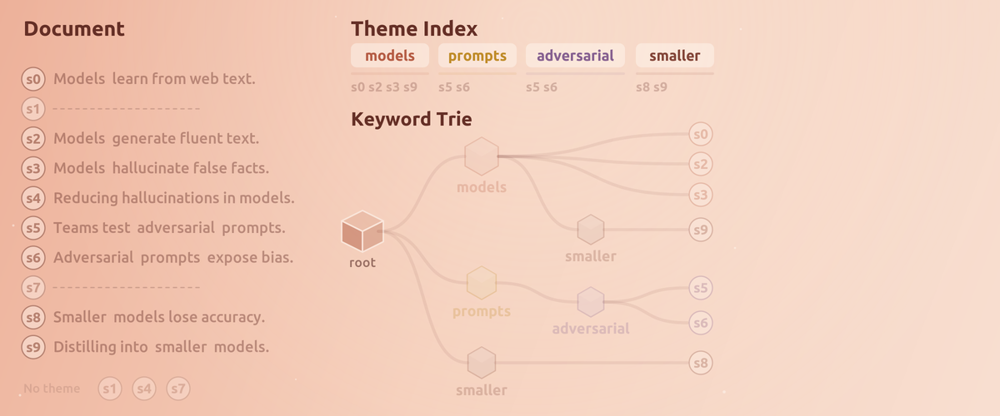

---
hide:
  - navigation
  - toc
---

# SALT

<div class="salt-hero" markdown>

</div>

**SALT keeps long context small.** It compresses documents and whole
conversations down to the sentences that carry the most information,
spreading the budget across a document's themes instead of ranking
everything by one score, so the minor points that answer real questions
survive. Any model, plain text out, less compute in.

<div class="salt-buttons" markdown>
[Get started](installation.md){ .md-button .md-button--primary }
[How it works](architecture.md){ .md-button }
</div>

<div class="grid cards" markdown>

- 🧂 **salt**

    ---

    Compress a document or dataset in one shot. The engine itself, and
    the surface the evaluation runs on.

    [Usage](usage.md)

- 🤖 **saltChat**

    ---

    A chat REPL where SALT is the conversation memory, so long chats
    and attached files stay recallable at a fixed prompt size.

    [Chatbot mode](chatbot.md)

- 🔌 **saltServe**

    ---

    A persistent model server chats connect to and resume against with
    their cache still warm.

    [Serving](serving.md)

- 🎛 **Options**

    ---

    Every flag of the three commands in one line each, including the
    off by default switches that make long sessions better.

    [Options](options.md)

- 🧩 **Architecture**

    ---

    The ideas behind the features: the keyword trie, coverage
    selection, the memory contract, and where each stage lives.

    [Architecture](architecture.md)

- 📈 **Results**

    ---

    A 44.60 LongBench average with Llama 3.1 8B at a 20% token budget,
    per dataset.

    [Results](results.md)

</div>

## 🧭 New here

1. [Install](installation.md) the environment and the three commands.
2. [Compress](usage.md) one document and read what SALT kept.
3. [Chat](chatbot.md) with a file attached and watch the memory block
   choose what to remember.
4. [Read why](architecture.md) selection spreads the budget across
   themes instead of ranking sentences.

## 🔭 Where the project is going

The [Roadmap](roadmap.md) lists what is in progress and what comes
next, and the [Changelog](changelog.md) explains what every version
changed in plain language.

## 📝 Paper

SALT is described in
[arXiv:2607.17486](https://arxiv.org/abs/2607.17486). The paper covers
the legacy selector, tagged
[v1.0.0](https://github.com/oteomamo/SALT/releases/tag/v1.0.0).
Current releases default to the coverage selector described on the
[Architecture](architecture.md) page.

```bibtex
@misc{mamo2026saltsalienceawarelexicaltrie,
      title={SALT: Salience-Aware Lexical Trie for Long-Context Compression},
      author={Oteo Mamo and Hyunjin Yi and Joydhriti Choudhury and Shangqian Gao and Weikuan Yu},
      year={2026},
      eprint={2607.17486},
      archivePrefix={arXiv},
      url={https://arxiv.org/abs/2607.17486}
}
```
